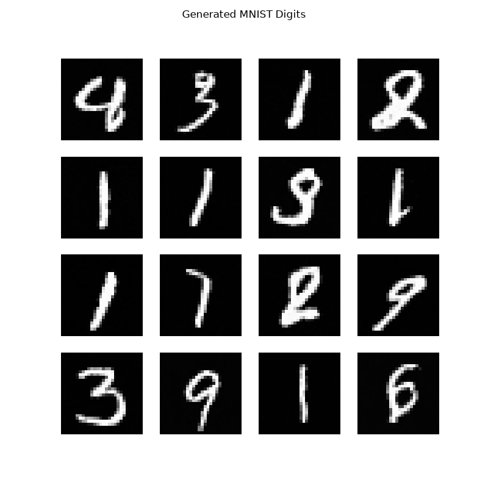

# noise-to-signal: PyTorch Implementation of Denoising Diffusion Probabilistic Models (DDPM)

A complete PyTorch implementation of DDPM from scratch. The noise schedule, time-conditioned UNet, training loop, and reverse sampling process are built and trained without using diffusers or pretrained components. Input noise into the model and it outputs a clean digit.


## Demo

The model runs 1000 reverse diffusion steps and produces a generated digit from pure Gaussian noise. Every pixel starts as random noise, and no image is ever shown to the model during generation. 


Loss converged from approx 1.39 -> 0.023

## How It Works

1. **Forward Diffusion Process** — An image `x_0` is transformed into pure noise using a stochastic process. A linear noise schedule (beta_start=1e-4, beta_end=0.02, T=1000) controls how much Gaussian noise is added at each timestep. The closed-form equation calculates each intermediate state `x_t` directly from the initial `x_0` image.

2. **Time-Conditioned UNet** — A U-Net with a downsampling path, bottleneck, and upsampling path connected by skip connections. A sinusoidal time embedding (transformer-style positional encoding) passes through a learned projection and is incorporated into each convolutional block, allowing the model to predict time-based noise.

3. **Training** —  The model is trained to predict the random noise added to an image. For every batch, a random timestep and noise sample are generated, and the closed-form equation is used to generate the noisy image. The predicted noise is compared to the actual noise using Mean Squared Error loss.

4. **Sampling** — The trained model starts from pure Gaussian noise and predicts and removes noise across all 1,000 timesteps. This reverse diffusion process transforms the noisy input into a final generated image.


## Project Structure

```
noise-to-signal/
├── README.md
├── requirements.txt
├── .gitignore
├── src/
│   ├── diffusion.py           # noise schedule, q_sample (forward process)
│   ├── unet.py                 # time-conditioned UNet
│   ├── train.py                # training loop
│   ├── sample.py                # reverse process/image generation
├── tests/                          # unit tests
├── checkpoints/                     # saved model weights (git-ignored)
├── data/                             # MNIST download location (git-ignored)
└── outputs/
```


## Setup

### Prerequisites

- Python 3.10+

### Installation

```bash
git clone https://github.com/r-sharma2/noise-to-signal.git
cd noise-to-signal

python -m venv venv
source venv/bin/activate

pip install -r requirements.txt
```

## Training Your Own Model

MNIST data and Checkpoints (every epoch) are auto-downloaded and not included in this repo.
### Train:
```bash
python -m src.train
```

- Per-epoch average loss is logged to `checkpoints/loss_history.json`
- Trained for 40 epochs on an Apple M2 Air (MPS backend) 

## Generating Samples

```bash
python -m src.sample
```

Loads a trained checkpoint, runs the full 1,000-step reverse diffusion process starting from random noise, and saves the resulting batch of generated images to `outputs/`.

## Testing

Core components (sinusoidal time embedding, UNet forward pass) are covered by unit tests:

```bash
pytest
```

## Tech Stack

| Component | Tool |
|---|---|
| Model framework | PyTorch 2.4 |
| Dataset | torchvision (MNIST) |
| Acceleration | Apple MPS (Metal GPU) |
| Testing | pytest |
| Visualization | matplotlib |

## Roadmap
Phase 1:
- [x] Linear noise schedule and closed-form forward process (`q_sample`)
- [x] Sinusoidal time embedding
- [x] Time-conditioned UNet with skip connections
- [x] Training loop with MSE noise-prediction loss
- [x] Full 1,000-step reverse sampling process
- [x] Unit tests for core components
Phase 2:
- [ ] Scale to CIFAR-10
- [ ] DDIM sampling for faster generation
- [ ] Classifier-free guidance for conditional generation
- [ ] Quantitative evaluation (FID, PSNR/SSIM)
- [ ] Forward/reverse diffusion process visualization
- [ ] Live demo (Gradio/Hugging Face Spaces)

## Limitations/Upcoming Improvements

- Currently trained on MNIST (28×28 grayscale). CIFAR-10 (roadmap) is a better test of the architecture
- No self-attention layers —  needed for high-res/complex datasets
- Sampling uses slow 1,000-step DDPM process. DDIM sampling (roadmap) will address this
- Evaluated visually with no FID/PSNR/SSIM numbers yet

## References

Ho, J., Jain, A., & Abbeel, P. (2020). *Denoising Diffusion Probabilistic Models*. [arXiv:2006.11239](https://arxiv.org/abs/2006.11239)

Weng, L. (2021). [What are Diffusion Models?](https://lilianweng.github.io/posts/2021-07-11-diffusion-models/)